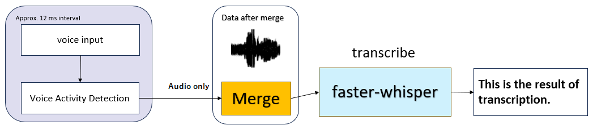
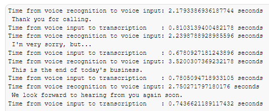
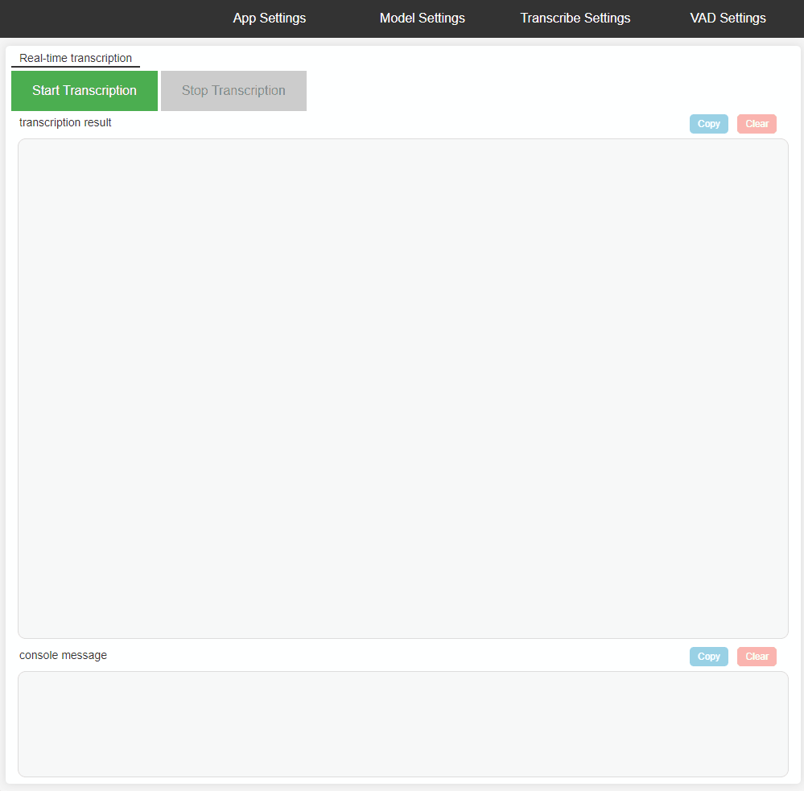

# speech-to-text

Real-time transcription using [faster-whisper](https://github.com/guillaumekln/faster-whisper)

Accepts audio input from a microphone using a [Sounddevice](https://github.com/spatialaudio/python-sounddevice). By using [Silero VAD](https://github.com/snakers4/silero-vad)(Voice Activity Detection), silent parts are detected and recognized as one voice data. This audio data is converted to text using Faster-Whisper.

The HTML-based GUI allows you to check the transcription results and make detailed settings for the faster-whisper.

## Transcription speed

If the sentences are well separated, the transcription takes less than a second.

Large-v2 model  
Executed with CUDA 11.7 on a NVIDIA GeForce RTX 3060 12GB.

## Installation

1. pip install .

## Usage

1. python -m speech_to_text
1. Select "App Settings" and configure the settings.
1. Select "Model Settings" and configure the settings.
1. Select "Transcribe Settings" and configure the settings.
1. Select "VAD Settings" and configure the settings.
1. Start Transcription

If you use the OpenAI API for text proofreading, set OPENAI_API_KEY as an environment variable.

## Notes

- If you select local_model in "Model size or path", the model with the same name in the local folder will be referenced.

## Demo

## News

### 2023-06-26

- Add generate audio files from input sound.
- Add synchronize audio files with transcription.  
Audio and text highlighting are linked.

### 2023-06-29

- Add transcription from audio files.(only wav format)

### 2023-07-03

- Add Send transcription results from a WebSocket server to a WebSocket client.  
Example of use: Display subtitles in live streaming.

### 2023-07-05

- Add generate SRT files from transcription result.

### 2023-07-08

- Add support for mp3, ogg, and other audio files.  
Depends on Soundfile support.
- Add setting to include non-speech data in buffer.  
While this will increase memory usage, it will improve transcription accuracy.

### 2023-07-09

- Add non-speech threshold setting.

### 2023-07-11

- Add Text proofreading option via OpenAI API.  
Transcription results can be proofread.

### 2023-07-12

- Add feature where audio and word highlighting are synchronized.  
if Word Timestamps is true.

### 2023-10-01

- Support for repetition_penalty and no_repeat_ngram_size in transcribe_settings.
- Updating packages.

## Todo

- [x] Save and load previous settings.

- [x] Use Silero VAD

- [x] Allow local parameters to be set from the GUI.

- [x] Supports additional options in faster-whisper 0.8.0
