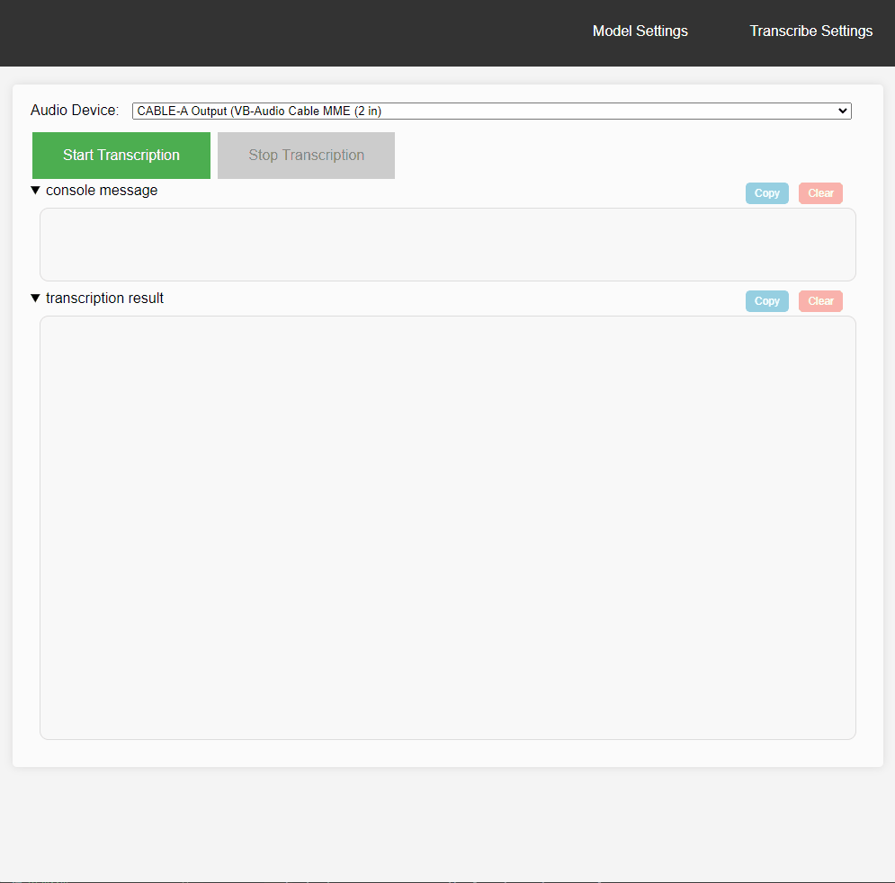

# speech-to-text

Real-time transcription using [faster-whisper](https://github.com/guillaumekln/faster-whisper)

## Installation

1. pip install .

## Usage

1. python -m speech_to_text
2. Select Input Audio Device
3. Select "Model Settings" and configure the settings.
4. Select "Transcribe Settings" and configure the settings.
5. Start Transcription

## Notes

- If you select local_model in "Model size or path", the model with the same name in the local folder will be referenced.
- I haven't validated the parameters because I don't know the proper value for 'Whisper' or 'faster-whisper'.
  Check the error message displayed on the console.

## Todo

1. Try Silero VAD
2. Allow local parameters to be set from the GUI.
